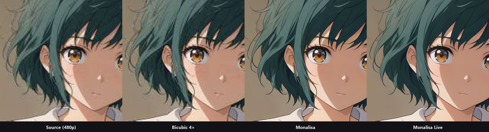
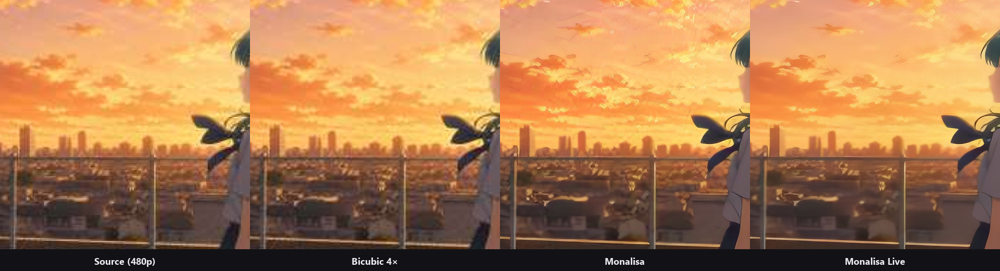
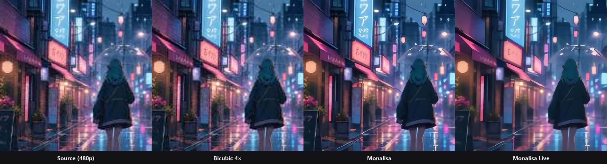

# Monalisa

**Monalisa** (also known as **AniTurk**) is a high-quality anime upscaler for turning 480p / 720p / DVD-era anime into a sharp 4K picture.

It is made for watching and exporting. The Windows app is [Aninmio 4K](https://aniturk.co). Weights and source are **not** public — this repository is the public gallery.

***Disclaimer: Demo frames in this README are original stills created for Monalisa. They are not scenes from existing anime. If you are a rights holder and want an image taken down, contact us via [aniturk.co](https://aniturk.co).***

## Foreword

Monalisa is built for **low-resolution and older anime**: 480p rips, 720p encodes, DVD sources, and heavy compression. That is a different job from sharpening native 1080p for a 4K TV.

Lightweight real-time filters (for example [Anime4K](https://github.com/bloc97/Anime4K)) are a good fit for live playback in a player or a browser. They run on the viewer’s GPU and do not need a server.

Monalisa is the quality path. It reconstructs line art and texture that those filters cannot bring back, then outputs 4K. It is not a real-time shader pack, and it is not a drop-in replacement for them.

Two looks:

| Name | What it is for |
| --- | --- |
| **Monalisa** | Faithful restore — cleaner lines, original palette |
| **Monalisa Live** | Punchier, more vivid — the “alive” look |

## Comparisons

480p source → 4K. **Zoom in.** Left to right: source, bicubic 4×, Monalisa, Monalisa Live.

### Portrait — line art and eyes

### Rooftop — character and city

### Rain street — hair, neon, reflections

Bicubic makes the frame larger. Monalisa puts the drawing back.

## Download

- **Windows app (Aninmio 4K):** [aniturk.co](https://aniturk.co)
- NVIDIA GPU recommended for export
- License key is entered in the app

This GitHub does **not** ship:

- model files
- training code
- inference source
- a how-to for reproducing the network

## Other websites

Sites that want a **live** upscale toggle (like a player setting) should use a real-time filter on the viewer’s machine. That needs no cloud GPU.

Sites that want **Monalisa 4K files** (restore + export) go through the Aninmio app or a private API. We do not publish an open inference server.

If you run a streaming site and want Monalisa as an option, reach us through [aniturk.co](https://aniturk.co).

## Acknowledgements

Thanks to everyone who watched early builds, sent broken rips, and argued about line thickness.

Monalisa exists because older anime still deserves a good 4K pass.

---

[Download](https://aniturk.co) · This gallery only · © 2026 AniTurk
